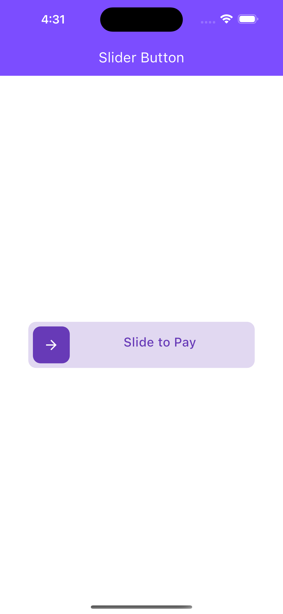
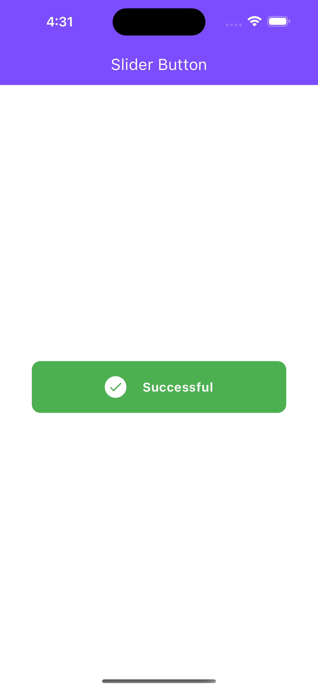

# Custom Slider Button

## Feature Overview
The Custom Slider Button is an impressive UI element that adds a touch of elegance and interactivity to your web or mobile applications. This feature-packed slider button offers a range of captivating functionalities, revolutionizing the user experience.

+ Swipe-to-Action: Users can swipe the slider button to perform specific actions, creating an intuitive and engaging interface. Whether it's swiping to complete a payment or unlock a feature, this functionality brings a new level of interactivity to your application.

+ Smooth Animation: The slider button smoothly glides from its starting position to the endpoint, providing a visually pleasing experience. Users will appreciate the seamless transition and polished feel of this dynamic animation.

+ Event Handling: The Custom Slider Button is equipped with robust event handling capabilities. You can easily define and customize actions triggered when the slider reaches the end or returns to the start, allowing for tailored interactions and seamless integration with your application's logic.

+ Versatile Design: With its customizable appearance, the slider button can be styled to match your application's branding or aesthetic preferences. From color schemes to button size and shape, you have the flexibility to create a visually stunning and cohesive user interface.

+ Responsive and Cross-Platform: The Custom Slider Button is designed to be fully responsive, adapting effortlessly to different screen sizes and devices. It works seamlessly across various platforms, including web browsers and mobile devices, ensuring a consistent user experience.

Experience the power of the Custom Slider Button and elevate your application's user interface to new heights. Download and integrate this feature-rich component into your projects on GitHub today.

## Design

 | 

| AWS                                                   | Git                                           |
| ----------------------------------------------------- | --------------------------------------------- |
|  |  |

